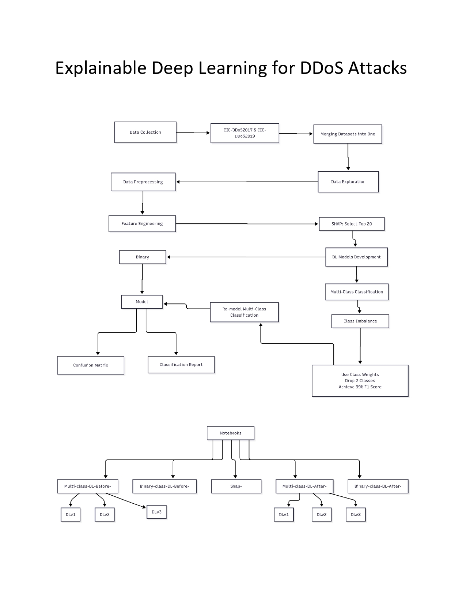

# Explainable-Deep-Learning-for-DDoS-Attacks

```


DDoS-Detection-DeepLearning/
├── data/
│   ├── raw/                  
│   ├── interim/               
│   │   ├── combined-data.xlsx
│   │   ├── Random_combine_final.xlsx
│   │   ├── Random-Clean.xlsx
│   │   └── Top20.xlsx         
│   └── processed/             
├── models/
│   ├── binary/              
│   │   ├── before_shap/    
│   │   │   └── LSTM-Binary-Before-Shap.py
│   │   └── after_shap/        
│   │       └── LSTM-Binary-After-Shap.py
│   └── multiclass/           
│       ├── before_shap/
│       │   └── LSTM-Multi-Before-Shap.py
│       └── after_shap/
│           └── LSTM-Multi-After-Shap.py
├── notebooks/                
│   ├── 1_Data_Collection_Preprocessing.ipynb
│   ├── 2_Data_Exploration_EDA.ipynb
│   ├── 3_SHAP_Feature_Engineering.ipynb
│   ├── 4_Binary_Class_DL_Before.ipynb
│   ├── 5_Binary_Class_DL_After.ipynb
│   ├── 6_Multi_Class_DL_Before.ipynb
│   ├── 7_Multi_Class_DL_After.ipynb
│   └── 8_Explainability_Analysis.ipynb
├── src/
│   ├── explainability/        
│   │   ├── shap_istm_explainer.py
│   │   └── __init__.py
│   └── utilities/             
│       ├── preprocessing.py
│       └── visualization.py
├── trained_models/          
│   ├── cic.h5
│   └── ddosattack.h5
├── results/                  
│   ├── binary/
│   │   └── after_shap/        
│   └── multiclass/
│       └── after_shap/       
├── reports/                   
│   ├── explainability/      
│   │   ├── output.png
│   │   ├── output2.png
│   │   ├── output3.png
│   │   └── output4.png
│   └── performance/         
└── README.md                 
# 🛡️ Explainable Deep Learning for DDoS Attacks
